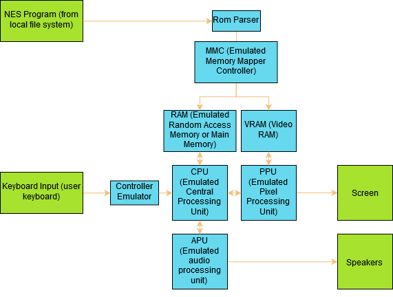

# Summary
This is a NES (Nintendo Entertainment System) emulator written in Rust using SDL2 for graphics and input.

## Why NES?
I have already written a [chip 8 emulator](https://github.com/maximveligan/chip_8), so the NES seemed like a good place to go next. It is a fairly well documented system, and is not too difficult for one person to finish. The NES is also a more rewarding system to emulate than the chip 8, since it has so many iconic games for it. The final reason for writing a NES emulator is that I wanted to learn more about how real hardware interfaces.

## Overview

The NES has three main processing units (CPU, PPU, and APU) that all parallel. Due to the serial nature of software, actually having these components run in parallel is not feasible for this emulator. I use the catch up technique of synchronization where I run the CPU for one instruction, and then pass the amount of cycles elapsed to the other hardware components.

## NES details
The CPU of the NES is essentially a 6502 processor without the decimal mode flag. It uses variable length opcodes and has 6 internal registers if counting the status register, stack pointer, and program counter. It communicates with other hardware components through memory mapped registers and interrupts.

## Mappers
The CPU of the NES has a 16 bit addressing range. Most games are larger than that, however. In order to get around this problem, most games have circuitry built in to them that allows dynamic bank swapping. These memory mappers have to be emulated as well, and any games that use mappers that are not currently emulated will not run. Currently, I have implemented mappers 0, 1, and 2.

## File Structure
- apu.rs contains all code relating to the audio processing unit
- config.rs allows users to create configurations that are loaded at runtime. If no configuration is found, it generates a default. You can view what an example configuration looks like in config.toml
- controller.rs contains the code emulating the NES controller
- cpu.rs and cpu_const.rs contain the imlementations of any CPU related components (opcodes, interrupts, dma, etc)
- lib.rs contains the main NesEmulator struct and exposes an API that allows users to create their own frontend for the emulator
- mapper.rs contains a series of dispatch functions that loads and executes the correct mapper at runtime. The mapper module currently contains implementations for mappers 0, 1, and 2
- mmu.rs takes care of which hardware component the CPU is actually accessing
- ppu.rs is the main driver for all of the ppu related emulation. The PPU module contains vram.rs which takes care of reading and writing to and from vram, sprite.rs which contains the sprite struct and helper methods, and pregisters.rs, which implements the PPU registers
- rom.rs contains the rom parser. It currently supports only the iNES format

## Credit
The following sources were used and are extremely valuable for any emulator developer that wants to create an NES emulator.
- http://wiki.nesdev.com/w/index.php/Nesdev_Wiki
- http://nesdev.com/undocumented_opcodes.txt
- https://n3s.io/index.php?title=How_It_Works#Graphic_Data
- https://opcode-defined.quora.com/
- http://obelisk.me.uk/6502/reference.html#BNE
- http://forums.nesdev.com/viewtopic.php?t=664
- http://forums.nesdev.com/
